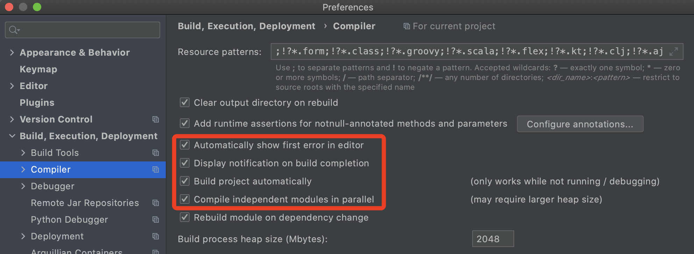

# 添加devtools

添加devtools依赖到本项目。

```xml
<dependency>
    <groupId>org.springframework.boot</groupId>
    <artifactId>spring-boot-devtools</artifactId>
    <scope>runtime</scope>
    <optional>true</optional>
</dependency>
```

# 添加插件

一般添加到父工程。

```xml
<plugin>
  <groupId>org.springframework.boot</groupId>
  <artifactId>spring-boot-maven-plugin</artifactId>
  <version>2.2.2.RELEASE</version>
  <configuration>
    <fork>true</fork>
    <addResources>true</addResources>
  </configuration>
</plugin>
```

# 开启IDEA的自动构建

设置->构建->编译



# 升级配置

window `shift+Ctrl+Alt+/`，Mac`shift+option+comman+/`，选择registry。

开启compiler.automake.allow.when.app.running和actionSystem.assertFocusAccessFromEdt。

# 重启IDEA

可能高版本IDEA无需重启。