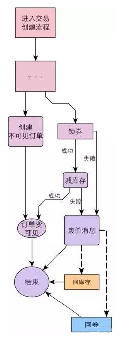

# 目的

保障分布式存储中数据一致性（完整性和正确性）。

# 方案

在一致性那篇文章中，已经有了理论依据，这里主要讲落地实现方案。

设定示例问题场景：一个业务操作，如果同时调用服务 A、B、C，需要满足要么同时成功；要么同时失败。A、B、C 可能是多个不同部门开发、部署在不同服务器上的远程服务。

## 基于消息的最终一致性

eBay方案

### 核心思想

eBay 的架构师Dan Pritchett，曾在一篇解释BASE 原理的论文《[Base：An Acid Alternative](https://queue.acm.org/detail.cfm?id=1394128)》中提到一个eBay 分布式系统一致性问题的解决方案。

**基本设计思想**是将**远程分布式事务**拆分成一系列的**本地事务**。

**具体思路**是将需要分布式处理的**任务**通过**消息或者日志**的方式来**异步执行**，消息或日志可以存到**本地**（文件、数据库或消息队列），再通过业务规则进行**失败重试**，它要求各服务的接口是**幂等**的。通过**消息系统**来通知其他事务参与方自己事务的执行状态。消息系统的引入更有效的将事务参与方**解耦**，各个参与方可以异步执行。

### 难点

解决**本地事务执行**和**消息发送**的一致性：两者要同时成功/失败。

### 实现方式

主要有2种：

- 基于事务消息
- 基于本地消息

#### 基于事务消息

普通消息是无法解决**本地事务执行**和**消息发送**的一致性问题的。因为消息发送涉及到网络通信，可能成功、失败、超时。其中超时最麻烦，发送方无法确定成功还是失败，此时消息发送方无论是提交事务还是回滚事务，都有可能不一致性出现。

为了解决这个问题，需要引入事务消息，事务消息和普通消息的区别在于事务消息发送成功后，处于 prepared 状态，不能被订阅者消费，等到事务消息commit之后，事务消息的状态才更改为可消费，下游订阅者才可以消费。

##### 过程

正常流程：

- 开始事务后的**第一步**是：发送一个事务消息。
- MQ 收到事务消息后，将消息持久化，消息的状态是“待发送”，并给发送者返回 ACK。
- 事务发起者
  - 如果没有收到ACK，则中断此次事务。
  - 如果收到了ACK，则执行本地事务，执行成功后再给MQ发送commit指令提交事务。
- MQ收到commit提交事务指令后，根据本地事务的执行情况更改事务消息的状态：
  - 如果本地事务成功，则将消息更改为“可消费”，并推送给订阅者。
  - 如果本地事务失败，则删除该事务消息。
- 下游参与者收到订阅的消息后，执行本地事务：
  - 如果成功，则给MQ返回ACK。
  - 如果失败，则不返回ACK，MQ会不断重试推送，直到进入死信队列。

异常流程：

- 本地事务执行完毕后，发给 MQ 的通知消息有可能丢失了。所以支持事务消息的 MQ 系统有一个定时扫描逻辑，扫描出状态仍然是“待发送”状态的消息，并向消息的发送方发起询问，询问这条事务消息的最终状态如何并根据结果更新事务消息的状态。因此事务的发起方需要给 MQ 系统提供一个事务消息状态查询接口。根据查询出的上游本地事务状态，来修改消息状态。

#### 基于本地消息

如果所依赖的 MQ 系统不支持事务消息，那么可以采用本地消息的分布式模式。

##### 过程

上游服务：

- 事务的发起方维护一个**本地消息表**，业务执行和本地消息表的执行处在**同一个本地事务**中。业务执行成功，则同时记录一条“**待发送**”状态的消息到本地消息表中。
- 系统中启动一个**定时任务**定时扫描本地消息表中状态为“待发送”的记录，并将其发送到 MQ 系统中，如果发送失败或者超时，则一直发送，直到发送成功后，从本地消息表中删除该记录（或修改状态为“已发送”）。
- 消息会重试发送，可能会重复，所以每条消息需要一个唯一ID。

下游服务：

- 为了避免消息重复消费，下游**消费端**服务需要做**幂等**。可以用业务状态，比如订单状态改为已支付，如果已经是已支付了就不用改了；如果业务逻辑无法保证幂等，可以维护一个**本地去重表**（或类似实现）记录已经处理消费过的消息，每次处理消息前通过该表检查消息是否消费过。

### 优缺点

基于消息的分布式事务可以将分布式系统之间**更有效的解耦**，各个事务参与方之间的调用**不再是同步调用**。

对MQ系统的要求较高，对业务实现也有一定的**侵入性**，要么提供事务消息状态查询接口，要么需要维护本地消息表。

并且原则上只接受下游分支事务的成功，不接受事务的回滚，如果失败就要一直重试，适用于**对最终一致性敏感度较低**的业务场景，例如跨企业的系统间的调用，适用的场景有限。

## 准实时的最终一致

蘑菇街方案

对于需要实时同步做、有强一致性要求的业务场景，比如交易创建过程中，锁券和扣减库存是这样的典型场景。

要保证多个系统间数据一致，乍一看，必须要引入分布式事务框架才能解决。但引入非常重的类似二阶段提交分布式事务框架会带来复杂性的急剧上升；在电商领域，绝对的强一致是过于理想化的，我们可以选择**准实时的最终一致性**。

我们在交易创建流程中，首先创建一个**不可见订单**，然后在**同步调用**锁券和扣减库存时，针对调用**异常**（失败或者超时），发出废单消息到MQ。如果消息发送失败，本地会做时间阶梯式的异步重试；优惠券系统和库存系统收到消息后，会进行判断是否需要做业务回滚，这样就准实时地保证了**多个本地事务**的**最终一致性**。

## XA

XA是一个规范、协议，它只是定义了一系列的接口，指的是 TM（事务管理器）和 RM（资源管理器）之间的接口，本质上也是借助两阶段提交协议来实现分布式事务。

存在的问题：

- 性能（阻塞性协议，增加响应时间、锁时间、死锁）

- 数据库支持完善度（MySQL 5.7之前都有缺陷）

- 协调者依赖独立的J2EE中间件（早期重量级Weblogic、Jboss，后期轻量级Atomikos、Narayana和Bitronix）

- 运维复杂，DBA缺少这方面经验

- 并不是所有资源都支持XA协议。

- 大厂懂所以不使用，小公司不懂所以不敢用

## Saga

Saga其实是30年前的一篇数据库论文里提到的一个概念。在论文中一个Saga事务就是一个长期运行的事务，这个事务是由多个本地事务所组成， 每个本地事务有相应的执行模块和补偿模块，当saga事务中的任意一个本地事务出错了， 可以通过调用相关事务对应的补偿方法恢复，达到事务的最终一致性。

**注意**：一阶段正向服务和二阶段补偿服务都由业务开发自己实现。

在分布式系统中由于网络请求可能的延时，在Caitie的论文中对被Saga调用的服务提出两点要求，我们需要Saga调用的服务支持**幂等**。 在服务请求的过程中，可能会出现超时重试的情况，我们需要通过幂等来避免多次请求所带来的问题。

前面提到了超时重试的机制，现在我们再来看看重试取消的情况。补偿可交换原则是指Saga并行处理的过程中，如果发生了超时重试事件之后，并进行了补偿的操作，那么补偿操作是直接生效的。

为了满足这个要求，需要我们在设计系统的过程中保留所有的事务数据。

由此我们可以知道Saga模型只支持ACD，不提供隔离性的保证。

因为saga事务没有准备阶段，事务没有隔离，如果两个saga事务同时操作同一资源就会遇到我们操作多线程临界资源的的情况。因此会产生更新丢失，脏数据读取等问题。

为了解决隔离性带来的问题，我们可以参考一下TCC的解决方案，从业务层面入手加入一Session以及锁的机制来保证能够串行化操作资源。也可以在业务层面通过预先冻结资金的方式隔离这部分资源， 最后在业务操作的过程中可以通过及时读取当前状态的方式获取到最新的更新。

目前业界提供了两类Saga的实现方式。 一个是集中式协调器的实现方式，一个分布式的实现方式。

集中式的Saga实现一般是通过一个Saga对象来追踪所有的Saga子任务的调用情况， 根据调用情况来决定是否需要调用对应的补偿方面，协调器和调用方是在一个进程中的。

集中式的Saga实现方式比较直观并且容易控制，问题是业务耦合程度会比较高。

### 事务框架

ByteTCC、TCC-transaction、EasyTransaction、Apache ServiceComb 以及 Seata，这里以seata为例。

Seata对XA以及TCC的支持亮点有限，这两种模式更多是为了兼容已有应用生态。

#### 亮点

# 参考

保证分布式系统数据一致性的6种方案：https://cloud.tencent.com/developer/article/1041507

分布式系统事务一致性解决方案：https://www.infoq.cn/article/solution-of-distributed-system-transaction-consistency/

由Seata看分布式事务取舍：https://www.jianshu.com/p/917cb4bdaa03

seata官网：http://seata.io/zh-cn/docs/overview/what-is-seata.html