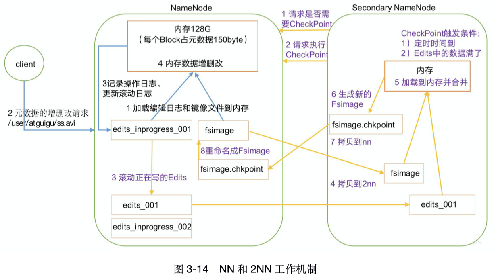
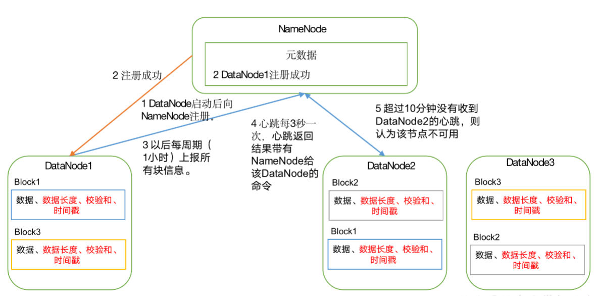
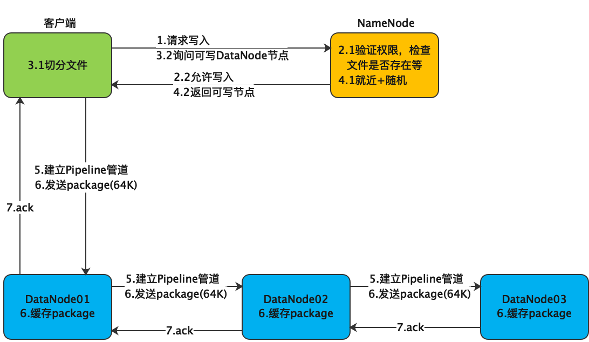
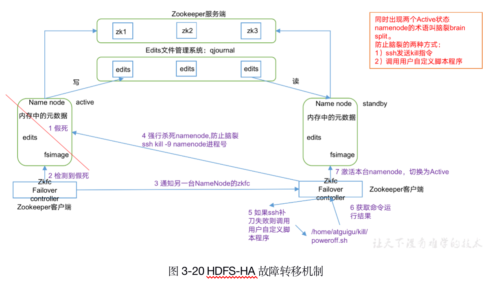
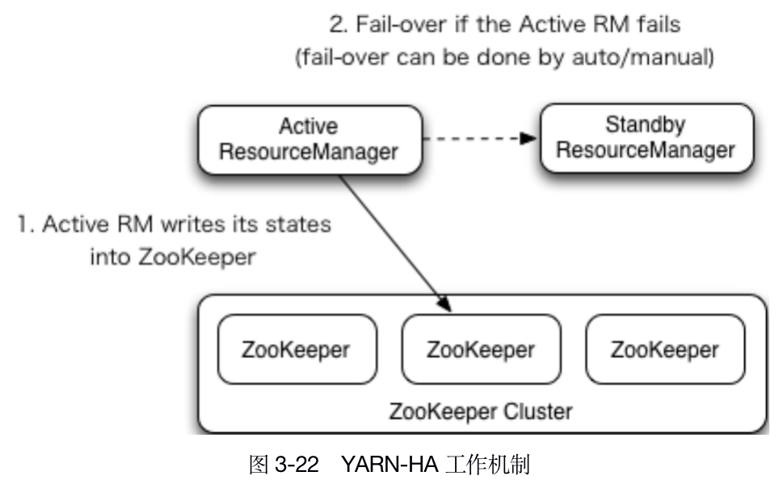
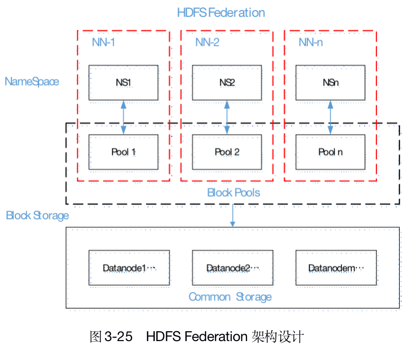

# 是什么

HDFS（Hadoop Distributed File System），是分布式文件系统。

# 应用场景（优缺点）

- 超大文件：TB、PB级。
- 流式数据访问：**一次写入、多次读取**，适合数据分析。
- 成本不高：使用商用硬件（在各种零售店能买到的普通硬件）即可。
- 高延迟的访问：高数据吞吐量，以提==**高延迟**==为代价。
- 不适合大量小文件：受限于NameNode内存容量（每个文件、目录和数据块的存储信息约占150字节，100万大概300M，数十亿就超出当前硬件的能力。）
- 单一写入：只支持==**单个写入者**==，且只能添加到文件末尾，==**不支持修改文件**==。

# 设计

## 1. 组成模块

### Client

- 文件切分。文件上传的时候，client将文件切分成一个一个的block，然后进行上传；
- 与NameNode交互，获取文件的位置信息；
- 与DataNode交互，读写数据；
- 提供一些命令来==管理==和==访问==HDFS。

### NameNode

就是master，是一个主管、管理者。

- 管理HDFS的名称空间；
- 管理数据块（block）映射信息；
- 配置副本策略；
- 处理客户端读写请求。

### Secondary NameNode

并非NameNode的热备。当NameNode挂掉的时候，它并不能马上替换NameNode提供服务。

- 辅助NameNode，==分担其工作量==，比如定期合并Fsimage和Edits，并推送给NameNode；
- 在紧急情况下，可辅助恢复NameNode。

### DataNode

就是 slave。NameNode下达命令，DataNode执行实际操作。

- 存储数据块；
- 响应client的数据块读写请求；
- 定时上报心跳、存储的块信息、块缓存。

## 2. NN和 2NN模块

### 工作机制

- 为了性能，元数据存都放在==内存==。
- 为了防止掉电导致数据丢失，需要定期通过FsImage镜像机制持久化到硬盘（类似Redis的RDB）。
- 定期会有延迟，会丢失少量最后的数据，引入 Edits 同步追加（类似Redis的AOF)，写元数据时，追加到 Edits 中。
- 一旦 NameNode 节点断电，可以将 FsImage 和 Edits 的合并，合成元数据。

**为什么需要 SecondaryNameNode？**

如果长时间添加数据到 Edits 中，会导致该文件数据过大，效率降低，且一旦断电，恢复元数据时间过长。因此，需要定期合并FsImage、Edits，如果这个操作由 NameNode 节点完成，效率过低。引入新节点2NN，专门用于 FsImage 和 Edits 的合并。



#### 第一阶段：NN 启动

1. 第一次启动 NN 格式化后，创建空的 Fsimage 和 Edits 文件。如果不是第一次启动，直接加载Edits和FsImage到内存。 
2. 客户端发送元数据写请求。 
3. NN 追加写操作到 Edits，更新滚动 Edits。 
4. NN 写内存中元数据。

#### 第二阶段：2NN 工作

1. 2NN 询问 NN 是否需要 CheckPoint（需要满足2个条件中的==任意1个==，定时时间到或 Edits 写满），如果NN确认需要CheckPoint，2NN 请求执行 CheckPoint。
2. NN 滚动到新的 Edits，并将滚动前的 Edits 和 FsImage 复制到 2NN。 
3. 2NN加载Edits和FsImage到内存合并，生成新的fsimage.chkpoint，并复制新的fsimage.chkpoint到 NN。 
4. NN 将 fsimage.chkpoint 重新命名成 fsimage，替换掉原来的 Fsimage。NN 在启动时就只需要加载之前未合并的 Edits 和 Fsimage 即可，因为合并过的 Edits 中的元数据信息已经被记录在 Fsimage 中。

### Fsimage 和 Edits

```sh
# NameNode被格式化后，将在【data目录（可在配置中修改）】下的 tmp/dfs/name/current 路径生成
cd /$HADOOP_HOME/data/tmp/dfs/name/current
ls -l
# fsimage文件：
HDFS文件系统元数据的一个==永久性检查点==，其中包含HDFS文件系统的所有目录和文件inode的序列化信息。
# edits文件：
存放HDFS文件系统的所有更新操作的路径，文件系统客户端执行的所有写操作首先会被记录到edits文件中。
# seen_txid文件：
保存的是一个数字，就是最后一个edits的数字。每次NameNode启动的时候，都会将fsimage文件读入内存，加载edits里的写操作，保证内存中的元数据信息是最新的、同步的，可以看成NameNode启动的时候就将fsimage和edits文件进行了合并。
```

```sh
# 命令(-i:指定输入，-o:指定输出)
hdfs oiv -p 文件类型 -i 镜像文件 -o 转换后文件输出路径

## 进入data目录（可在配置中修改）下的 tmp/dfs/name/current
cd /$HADOOP_HOME/data/tmp/dfs/name/current
# 查看Fsimage
## 将fsimage文件转换成XML，并输出到~/
hdfs oiv -p XML -i fsimage_0000000000000000025 -o ./fsimage.xml
## 查看（将xml复制到vsCode格式化）
cat fsimage.xml
### 从xml文件中可以看出，Fsimage中没有记录块所对应DataNode，为什么？
### 在集群启动后，要求DataNode上报数据块信息，并间隔一段时间后再次上报。

# 查看edits
## 将edits文件转换成XML，并输出到 ~/
hdfs oev -p XML -i edits_0000000000000000012-0000000000000000013 -o ./edits.xml
## 查看（将xml复制到vsCode格式化）
cat edits.xml
```

### CheckPoint 时间设置

hdfs-default.xml

```xml
<!-- SecondaryNameNode每隔一小时执行一次 -->
<property>
  <name>dfs.namenode.checkpoint.period</name>
  <value>3600</value>
</property>
<!-- 1分钟检查1次操作次数，当操作次数达到1百万时，SecondaryNameNode执行一次 -->
<property>
  <name>dfs.namenode.checkpoint.txns</name>
  <value>1000000</value>
	<description>操作动作次数</description>
</property>
<property>
  <name>dfs.namenode.checkpoint.check.period</name>
  <value>60</value>
	<description> 1分钟检查一次操作次数</description>
</property>
```

### 故障处理

NN故障后，可以采用如下 2种方法恢复数据。

方法一：手动将 2NN 中数据复制到 NN

  ```shell
kill -9 NN进程
# 删除NN存储的数据
rm -rf /$HADOOP_HOME/data/tmp/dfs/name/*
# 复制 2NN 中数据到 NN
scp -r idc@hadoop104:/$HADOOP_HOME/data/tmp/dfs/namesecondary/* ./name/
# 重新启动NameNode
hadoop-daemon.sh start namenode
  ```

方法二：使用`-importCheckpoint` 选项

hdfs-site.xml

```xml
<property>
  <name>dfs.namenode.checkpoint.period</name>
  <value>120</value>
</property>
<property>
  <name>dfs.namenode.name.dir</name>
  <value>/opt/module/hadoop-2.7.2/data/tmp/dfs/name</value>
</property>
```

```sh
kill -9 NN进程
# 删除NN存储的数据
rm -rf /$HADOOP_HOME/data/tmp/dfs/name/*
# 如果2NN不和NN在一个主机节点上，需要将2NN存储数据的目录复制到NN存储数据的平级目录，并删除in_use.lock文件
scp -r idc@hadoop104:/$HADOOP_HOME/data/tmp/dfs/namesecondary ./
rm -rf in_use.lock
# 导入检查点数据（等待一会ctrl+c结束掉）
hdfs namenode -importCheckpoint
# 启动NameNode
hadoop-daemon.sh start namenode
```

### 多目录配置

NameNode的本地目录可以配置成多个，且每个目录存放==内容相同==，增加了可靠性；其实还是在同一台机器上，对高可靠==作用不大==。

hdfs-site.xml

```xml
<property>
  <name>dfs.namenode.name.dir</name>	<value>file:///${hadoop.tmp.dir}/dfs/name1,file:///${hadoop.tmp.dir}/dfs/name2</value>
</property>
```

```sh
# 停止集群，删除集群中【所有机器】上的data和logs
rm -rf data/ logs/
xsync /$HADOOP_HOME/etc/hadoop/
# 格式化集群并启动
hdfs namenode –format
start-dfs.sh
```

## 3. DataNode模块

### 工作机制



1. 一个数据块在DataNode上以文件形式存储在磁盘上，包括两个文件：数据和元数据（Block长度、CheckSum、时间戳）。
2. DataNode启动后向NN注册，通过后，周期性（1小时）的向NN上报所有的块信息。
3. 心跳是每3秒一次，心跳返回结果带有NameNode给该DataNode的命令，如复制块数据到另一台机器，或删除某个Block。如果超过10分钟没有收到某个DataNode的心跳，则认为该节点不可用。
4. 集群运行中可以安全加入和退出一些机器。

### 数据完整性

**如果DataNode节点上的数据损坏了，却没有发现，很危险，如何解决？**

如下是DataNode节点保证数据完整性的方法。

当DataNode读取Block的时候，它会计算CheckSum。如果计算后的CheckSum，与Block创建时值不一样，说明Block已经损坏。Client改读取其他DataNode上的Block。DataNode在文件创建后会==周期性==的验证CheckSum。


### 掉线时限参数设置

DataNode进程挂掉或者网络故障导致DataNode和NameNode无法通信，NameNode不回立即把该节点判定为死亡，需要经过一段超时时间。默认超时时间是10分钟+30秒。超时时间计算公式：

```sh
Timeout = 2 * dfs.namenode.heartbeat.recheck-interval + 10 * dfs.heartbeat.interval
# dfs.namenode.heartbeat.recheck-interval的单位是：毫秒
# dfs.heartbeat.interval的单位是：秒
```

```xml
<property>
    <name>dfs.namenode.heartbeat.recheck-interval</name>
    <value>300000</value>
</property>
<property>
    <name>dfs.heartbeat.interval</name>
    <value>3</value>
</property>
```

### 块大小

块的大小可以通过配置参数(dfs.blocksize)来规定，默认大小在Hadoop2.x版本中是128M，老版本中是64M。

1. 如果寻址时间约为10ms，即查询到目标block的时间为10ms；
2. 寻址时间为传输时间的1%时，则为最佳状态。因此，传输时间=10ms/0.01=1000ms=1s；
3. 目前磁盘的传输速率普遍为100MB/s。5个block大小 = 1s*100MB/s = 100MB。

##### 为什么块不能太大，也不能太小？

1. 太小，会增加寻址时间；
2. 太大，会增加传输时间；

总结：块大小设置主要**==取决于磁盘传输速率==**。

### 增加新节点

随着公司业务的增长，数据量越来越大，原有的容量已经不能满足需求，需要动态添加新的数据节点。

#### 环境准备

1. 在 hadoop103 主机上再克隆一台 hadoop104 主机 

2. 修改 IP 地址和主机名称

3. 删除原来 HDFS 文件系统留存的文件（/opt/module/hadoop-2.7.2/data 和 log） 

4. source 一下配置文件


#### 具体步骤

1. 直接启动 DataNode，即可关联到集群

   ```shell
   hadoop-daemon.sh start datanode
   yarn-daemon.sh start nodemanager
   ```

2. 在 hadoop104 上上传文件

   ```shell
   hadoop fs -put /opt/module/hadoop-2.7.2/LICENSE.txt /
   ```

3. 如果数据不均衡，可以用命令实现集群的再平衡

   ```shell
   start-balancer.sh
   ```

### 下线旧节点

#### 白名单

添加到白名单的主机节点，都允许访问 NameNode，不在白名单的主机节点，都会被退出。

一般在刚开始搭集群的时候就设置好。

步骤如下:

1. 在NameNode的/opt/module/hadoop-2.7.2/etc/hadoop目录下创建dfs.hosts文件

   ```shell
   cd /$HADOOP_HOME/etc/hadoop
   touch dfs.hosts
   vim dfs.hosts
   # 添加如下主机名称（不添加hadoop104）
   hadoop101
   hadoop102
   hadoop103
   ```

2. 在NameNode的hdfs-site.xml配置文件中增加dfs.hosts属性

   ```xml
   <property>
   	<name>dfs.hosts</name>
   	<value>/opt/module/hadoop-2.7.2/etc/hadoop/dfs.hosts</value>
   </property>
   ```

3. 分发配置

   ```shell
   xsync hdfs-site.xml
   ```

4. 刷新NameNode、ResourceManager

   ```shell
   hdfs dfsadmin -refreshNodes
   yarn rmadmin -refreshNodes
   ```

5. 在web浏览器上查看

   ```html
   http://hadoop101:50070/
   ```

6. 如果数据不均衡，可以用命令实现集群的再平衡

   ```shell
   start-balancer.sh
   ```

#### 黑名单

在黑名单上面的主机都会被强制退出。

1. 在NameNode的/opt/module/hadoop-2.7.2/etc/hadoop目录下创建dfs.hosts.exclude文件

   ```shell
   cd /$HADOOP_HOME/etc/hadoop
   touch dfs.hosts.exclude
   vim dfs.hosts.exclude
   # 添加如下主机名称（要退役的节点）
   hadoop105
   ```

2. 在NameNode的hdfs-site.xml配置文件中增加dfs.hosts.exclude属性

   ```xml
   <property>
   	<name>dfs.hosts.exclude</name>
   	<value>/opt/module/hadoop-2.7.2/etc/hadoop/dfs.hosts.exclude</value>
   </property>
   ```

3. 刷新NameNode、刷新ResourceManager

   ```shell
   hdfs dfsadmin -refreshNodes
   yarn rmadmin -refreshNodes
   ```

4. 检查Web浏览器，退役节点的状态为`decommission in progress`（退役中），说明数据节点正在复制块到其他节点。

5. 等待退役节点状态为decommissioned（所有块已经复制完成），停止该节点及节点资源管理器。注意：如果副本数是3，服役的节点小于等于3，是不能退役成功的，需要修改副本数后才能退役。

6. 关闭退役的节点

   ```shell
   hadoop-daemon.sh stop datanode
   yarn-daemon.sh stop nodemanager
   ```

7. 如果数据不均衡，可以用命令实现集群的再平衡

   ```shell
   start-balancer.sh
   ```

#### 注意：

==不允许白名单和黑名单中同时出现同一个主机名称。==

### 多目录配置

DataNode也可以配置成多个目录，每个目录存储的数据不一样。即：数据不是副本

```xml
<!-- hdfs-site.xml -->
<property>
	<name>dfs.datanode.data.dir</name>	<value>file:///${hadoop.tmp.dir}/dfs/data1,file:///${hadoop.tmp.dir}/dfs/data2</value>
</property>
```

## 安全模式

安全模式是一种保护机制，用于保证集群中block的安全性。集群启动时，会首先进入安全模式，以检查block的完整性。

假设我们设置的副本数是3，如果DataNode上只有2个副本，那么比例是2/3=0.666，HDFS默认的副本率是0.999，我们的副本率明显不够，因此系统会自动的复制副本到其他DataNode。如果DataNode有5个副本，会删除多余的2个副本。

安全模式下，只能读不能写。当安全达标之后，会自动退出安全模式。

### 命令

```sh
hdfs dfsadmin -safemode get		# 查看安全模式状态
hdfs dfsadmin -safemode enter  # 进入安全模式
hdfs dfsadmin -safemode leave	 # 退出安全模式
hdfs dfsadmin -safemode wait	# 等待安全模式状态
```

## 组合模块工作流程

学习完各个模块的功能和原理之后，把这些模块组合在一起的工作流程。

### 文件写入流程



1. 客户端向 NameNode发起写入请求。 
2. NameNode：
   - 验证权限；
   - 检查文件是否已存在，父目录是否存在；不通过抛异常，通过可以上传。
3. 客户端切分文件，并询问第一个Block放到哪些DataNode。
4. NameNode根据副本数量、机架感知原理以及网络拓扑关系【就近+随机】，寻找适合的节点返回给客户端。
5. 客户端连接dn1，dn1连接dn2，dn2连接dn3，链式建立Pipeline管道。
6. 客户端开始往管道传输数据，以package(64kb)为单位发送；当dn1接收到先缓存，然后发送到dn2，dn2接收到也缓存，然后发送到dn3；
7. 当每一个DataNode接收到数据后，都给ack的应答响应，告知已经接收完毕。 
8. 一个一个package的串行发送，发完一个block，又重新询问，执行3-7步。

### 文件读取流程

1. 客户端通过向 NameNode 发起读取请求；
2. NameNode：
   - 检查权限；
   - 查询元数据，找到每个block所在的DataNode地址，返回block:DataNode映射列表给客户端。 
3. 和每一个block所在的DataNode建立Pipeline。
4. 并行读取每个block，以package(64k)为单位传输。
5. 合并block成一个完整的文件。

#### 节点距离计算

##### 原理

NameNode 会选择==距离最近==的 DataNode 接收写入。怎么计算最近距离？ 

树结构，两个节点到达最近的共同祖先节点的距离总和，哪个经过的边最少，哪个就最近。

##### Hadoop 2.7.2版本节点选择机制

- 第一个副本在client所在节点，如果client在【集群】外，随机选一个。
- 第二个副本和第一个副本位于相同【机架】，随机节点。
- 第三个副本位于不同的机架，随机节点。

# 使用

## 命令行

### 基本语法

```sh
# dfs 是 fs 的实现类
hdfs dfs 【具体命令】
# 新版本中这个好像过时了
hadoop fs 【具体命令】
```

### 常用命令

```sh
# 启动HDFS集群
start-dfs.sh
# 帮助
hdfs dfs -help 
hdfs dfs -ls /
#【递归】创建目录
hdfs dfs -mkdir -p /sanguo/shuguo
# 从【本地】剪切粘贴到【HDFS】
hdfs dfs -moveFromLocal ./kongming.txt /sanguo/shuguo
# 追加一个文件到【已存文件】末尾
hdfs dfs -appendToFile liubei.txt /sanguo/shuguo/kongming.txt
hdfs dfs -cat /sanguo/shuguo/kongming.txt

# 修改文件操作权限
hdfs dfs -chmod 666 /sanguo/shuguo/kongming.txt
# 修改文件所属用户
hdfs dfs -chown idc:idc /sanguo/shuguo/kongming.txt

# 从【本地文件系统】中复制文件到【HDFS】
hdfs dfs -copyFromLocal README.txt /
# 等同于 copyFromLocal
hdfs dfs -put ./zaiyiqi.txt /user/idc/test/

# 从【HDFS】复制到【本地】
hdfs dfs -copyToLocal /sanguo/shuguo/kongming.txt ./
# 从HDFS下载文件到本地（等同于 copyToLocal）
hdfs dfs -get /sanguo/shuguo/kongming.txt ./
# 合并【下载】多个文件
hdfs dfs -getmerge /user/idc/test/* ./zaiyiqi.txt

# 从HDFS的一个路径复制到HDFS的另一个路径
## -f：覆盖目标（如果已经存在）
## -p：保留文件属性(时间戳、所有权、许可、ACL、XAttr)
hdfs dfs -cp /sanguo/shuguo/kongming.txt /zhuge.txt
hdfs dfs -mv /zhuge.txt /sanguo/shuguo/

# 统计文件夹大小
hdfs dfs -du -s -h /user/idc/test
# 设置指定文件的副本数量
## 注意：这里只是设置，是否真的会有这么多副本，得看 DataNode 的数量。如果只有3台设备，最多也就3个副本，只有节点数的增加到10台时，副本数才能达到10。
hdfs dfs -setrep 10 /sanguo/shuguo/kongming.txt
```

## 客户端操作

### 客户端环境准备

1. 根据操作系统复制对应的编译后的 hadoop jar 包到非中文路径（资料>01_jar包）

2. 配置HADOOP_HOME 环境变量；

3. 创建一个maven工程

4. 导入相应依赖+日志

   ```xml
   <dependency>
       <groupId>junit</groupId>
       <artifactId>junit</artifactId>
       <version>RELEASE</version>
   </dependency>
   <dependency>
       <groupId>org.apache.logging.log4j</groupId>
       <artifactId>log4j-core</artifactId>
       <version>2.8.2</version>
   </dependency>
   <dependency>
       <groupId>org.apache.hadoop</groupId>
       <artifactId>hadoop-common</artifactId>
       <version>2.7.2</version>
   </dependency>
   <dependency>
       <groupId>org.apache.hadoop</groupId>
       <artifactId>hadoop-client</artifactId>
       <version>2.7.2</version>
   </dependency>
   <dependency>
       <groupId>org.apache.hadoop</groupId>
       <artifactId>hadoop-hdfs</artifactId>
       <version>2.7.2</version>
   </dependency>
   <dependency>
       <groupId>jdk.tools</groupId>
       <artifactId>jdk.tools</artifactId>
       <version>1.8</version>
       <scope>system</scope>
       <systemPath>${JAVA_HOME}/lib/tools.jar</systemPath>
   </dependency>
   ```

   ```properties
   # 在项目的 src/main/resources 目录下，新建“log4j.properties”文件，并输入如下配置：
   log4j.rootLogger=INFO, stdout log4j.appender.stdout=org.apache.log4j.ConsoleAppender log4j.appender.stdout.layout=org.apache.log4j.PatternLayout log4j.appender.stdout.layout.ConversionPattern=%d %p [%c] - %m%n log4j.appender.logfile=org.apache.log4j.FileAppender log4j.appender.logfile.File=target/spring.log log4j.appender.logfile.layout=org.apache.log4j.PatternLayout log4j.appender.logfile.layout.ConversionPattern=%d %p [%c] - %m%n
   ```

5. 创建包和类

   ```java
   public class HdfsClient {
       @Test
       public void testMkdirs() throws IOException, InterruptedException, URISyntaxException {
           Configuration configuration = new Configuration();
           // 第一种方式，需要在运行的时候配jvm参数：：-DHADOOP_USER_NAME=idc，idc为用户名称；
           // 配置在集群上运行
           // configuration.set("fs.defaultFS", "hdfs://hadoop101:9000");
           // 获取文件系统
           // FileSystem fs = FileSystem.get(configuration);
   
           //  第二种方式
           FileSystem fs = FileSystem.get(new URI("hdfs://hadoop101:9000"), configuration, "idc");
         
           // 2 创建目录
           fs.mkdirs(new Path("/user/idc/test_client"));
           // 3 关闭资源
           fs.close();
       }
   }
   ```

### API

#### 文件上传

##### 1. 编写源码

```java
// 2 上传文件 
fs.copyFromLocalFile(new Path("e:/banzhang.txt"), new Path("/banzhang.txt"));
```

##### 2. 将 hdfs-site.xml 复制到项目的根目录

```xml
<?xml version="1.0" encoding="UTF-8"?> <?xml-stylesheet type="text/xsl" href="configuration.xsl"?>
<configuration> 
  <property> 
    <name>dfs.replication</name> 
    <value>1</value> 
  </property>
</configuration>
```

##### 3．参数优先级

参数优先级排序：

1. 客户端代码中设置的值 >大于>
2. ClassPath 下的用户自定义配置文件 >大于>
3. 然后是服务器的默认配置

#### 文件下载

```java
// 2 执行下载操作 
// boolean delSrc 指是否将原文件删除 
// Path src 指要下载的文件路径 
// Path dst 指将文件下载到的路径 
// boolean useRawLocalFileSystem 是否开启文件校验 
fs.copyToLocalFile(false, new Path("/test.txt"), new Path("/Downloads/aaa.txt"), true);
```

#### 文件删除

```java
// 2 执行删除 
fs.delete(new Path("/0508/"), true);
```

#### 文件名修改

```java
// 2 修改文件名称
fs.rename(new Path("/banzhang.txt"),new Path("/banhua.txt"));
```

#### 文件详情查看

查看文件名称、权限、长度、块信息

```java
// 2 获取文件详情 
RemoteIterator<LocatedFileStatus> listFiles = fs.listFiles(new Path("/"), true);
while(listFiles.hasNext()){ 
  LocatedFileStatus status = listFiles.next();
	// 输出详情 
  // 文件名称 
  System.out.println(status.getPath().getName()); 
  // 长度 
  System.out.println(status.getLen()); 
  // 权限 
  System.out.println(status.getPermission()); 		
  // 分组 
	System.out.println(status.getGroup());
	// 获取存储的块信息 
	BlockLocation[] blockLocations =  status.getBlockLocations();
  
	for (BlockLocation blockLocation : blockLocations) {
		// 获取块存储的主机节点 
  	String[] hosts = blockLocation.getHosts();
		for (String host : hosts) {
    	System.out.println(host);
  	}
	}
	System.out.println("-----------班长的分割线----------");
}
```

#### 文件和文件夹判断

```java
// 2 判断是文件还是文件夹 
FileStatus[] listStatus = fs.listStatus(new Path("/"));

for (FileStatus fileStatus : listStatus) {
	// 如果是文件 
  if (fileStatus.isFile()) {
		System.out.println("f:"+fileStatus.getPath().getName()); 
  }else {
		System.out.println("d:"+fileStatus.getPath().getName()); 
  } 
}
```

### I/O流操作

上面的 API 操作 HDFS 系统都是框架封装好的。那么如果我们想自己实现上述 API 的操作该怎么实现呢？ 

我们可以采用 IO 流的方式实现数据的上传和下载。

#### 文件上传

```java
// 2 创建输入流 
FileInputStream fis = new FileInputStream(new File("e:/banhua.txt"));
// 3 获取输出流 
FSDataOutputStream fos = fs.create(new Path("/banhua.txt"));
// 4 流对拷 
IOUtils.copyBytes(fis, fos, configuration);
// 5 关闭资源 
IOUtils.closeStream(fos); 
IOUtils.closeStream(fis);
```

#### 文件下载

```java
// 2 获取输入流 
FSDataInputStream fis = fs.open(new Path("/banhua.txt"));
// 3 获取输出流
FileOutputStream fos = new FileOutputStream(new File("e:/banhua.txt"));
// 4 流的对拷 
IOUtils.copyBytes(fis, fos, configuration);
// 5 关闭资源
IOUtils.closeStream(fos); 
IOUtils.closeStream(fis);
```

#### 定位文件读取

##### 下载第一块

```java
// 2 获取输入流 
FSDataInputStream fis = fs.open(new Path("/hadoop-2.7.2.tar.gz"));
// 3 创建输出流 
FileOutputStream fos = new FileOutputStream(new File("e:/hadoop-2.7.2.tar.gz.part1"));
// 4 流的拷贝 
byte[] buf = new byte[1024];
for(int i =0 ; i < 1024 * 128; i++){ 
  fis.read(buf); 
  fos.write(buf); 
}
// 5 关闭资源 
IOUtils.closeStream(fis); 
IOUtils.closeStream(fos);
```

#### 下载第二块

```java
// 2 打开输入流 
FSDataInputStream fis = fs.open(new Path("/hadoop-2.7.2.tar.gz"));
// 3 定位输入数据位置 
fis.seek(1024*1024*128);
// 4 创建输出流 
FileOutputStream fos = new FileOutputStream(new File("e:/hadoop-2.7.2.tar.gz.part2"));
// 5 流的对拷 
IOUtils.copyBytes(fis, fos, configuration);
// 6 关闭资源 
IOUtils.closeStream(fis); 
IOUtils.closeStream(fos);
```

##### 合并文件

```shell
$ cat hadoop-2.7.2.tar.gz.part2 >> hadoop-2.7.2.tar.gz.part1
# 合并完成后，将 hadoop-2.7.2.tar.gz.part1 重新命名为 hadoop-2.7.2.tar.gz。解压发现该 tar 包非常完整。
```


# 2.X 新特性

## 集群间数据复制

```shell
# scp实现两个远程主机之间的文件复制
## 推
scp -r hello.txt root@hadoop103:/user/idc/hello.txt
## 拉
scp -r root@hadoop103:/user/idc/hello.txt  hello.txt
## 通过本地主机中转实现两个远程主机的文件复制（如果在两个远程主机之间ssh没有配置的情况下可以使用该方式)
scp -r root@hadoop103:/user/idc/hello.txt root@hadoop104:/user/idc

# 采用distcp命令实现两个Hadoop集群之间的递归数据复制
hadoop distcp hdfs://haoop101:9000/user/idc/hello.txt hdfs://hadoop102:9000/user/idc/hello.txt
```

## 小文件归档

### 小文件弊端

- 低效。
- 耗NameNode内存（不耗DataNode内存，因为只占用实际大小，1MB的数据不会占128MB）。

### 解决方案

归档文件或HAR文件，将文件存入HDFS块，还允许对文件进行透明访问。存档文件对内还是各自独立文件，对NameNode却是一个整体，减少了NameNode占用。

归档：

也称为打包，指的是一个文件或目录的集合，而这个集合被存储在一个文件中。归档文件没有经过压缩，因此，它占用的空间是其中所有文件和目录的总和。

### 示例

```shell
# 启动YARN
start-yarn.sh
# 归档文件：把/user/idc/input目录里的所有文件归档成一个input.har，并存储到/user/idc/output
bin/hadoop archive -archiveName input.har –p /user/idc/input /user/idc/output
# 查看归档
hadoop fs -lsr /user/idc/output/input.har
hadoop fs -lsr har:///user/idc/output/input.har
# 解归档
hadoop fs -cp har:///user/idc/output/input.har/* /user/idc
```

## 回收站

将删除的文件在不超时的情况下，恢复原数据，起到防止误删除、备份等作用。

### 工作机制

文件删除到回收站之后，会定期检查看，如果到期则彻底删除（所以定期检查时间要 <= 保留时间）。

### 示例

core-site.xml

```xml
<!--文件在回收站保留2分钟。0表示禁用回收站；大于0表示文件在回收站保留时间，单位分钟-->
<property>
	<name>fs.trash.interval</name>
	<value>2</value>
</property>
<!--定期检查时间。如果为0，则必须和fs.trash.interval值相等，否则要小于等于fs.trash.interval-->
<property>
	<name>fs.trash.checkpoint.interval</name>
	<value>1</value>
</property>
<!--进入垃圾回收站的用户名默认是dr.who，需要修改为 idc 用户-->
<property>
  <name>hadoop.http.staticuser.user</name>
  <value>idc</value>
</property>
```

```shell
# 命令行删除数据到回收站，回收站在HDFS中的路径：/user/idc/.Trash/Current/...
hdfs dfs -rm /test.txt
# 恢复回收站数据
hadoop fs -mv /user/idc/.Trash/Current/user/idc/input /user/idc/input
# 清空回收站
hadoop fs -expunge
```

```java
// 注意：通过程序删除的文件不会经过回收站，需要调用`moveToTrash()`才进入回收站
Trash trash = New Trash(conf);
trash.moveToTrash(path);
```

## 快照管理

快照相当于对目录做一个备份。==并不会立即复制所有文件==，而是记录文件变化。

### 常用命令

```shell
# 开启指定目录的快照功能
hdfs dfsadmin -allowSnapshot 路径
# 禁用指定目录的快照功能，默认是禁用
hdfs dfsadmin -disallowSnapshot 路径
# 对目录创建快照
hdfs dfs -createSnapshot 路径
# 指定名称创建快照
hdfs dfs -createSnapshot 路径 名称
# 重命名快照
hdfs dfs -renameSnapshot 路径 旧名称 新名称
# 列出当前用户所有可快照目录
hdfs lsSnapshottableDir  
# 比较两个快照目录的不同之处
hdfs snapshotDiff 路径1 路径2 
# 删除快照
hdfs dfs -deleteSnapshot <path> <snapshotName>
```

### 示例

```shell
# 开启/禁用指定目录的快照功能
hdfs dfsadmin -allowSnapshot /user/idc/input
hdfs dfsadmin -disallowSnapshot /user/idc/input
# 对目录创建快照
hdfs dfs -createSnapshot /user/idc/input
# 通过web访问hdfs://hadoop102:50070/user/idc/input/.snapshot/s…..// 快照和源文件使用相同数据
hdfs dfs -lsr /user/idc/input/.snapshot/
# 指定名称创建快照
hdfs dfs -createSnapshot /user/idc/input  miao170508
# 重命名快照
hdfs dfs -renameSnapshot /user/idc/input/  miao170508 idc170508
# 列出当前用户所有可快照目录
hdfs lsSnapshottableDir
# 比较两个快照目录的不同之处
hdfs snapshotDiff /user/idc/input/ . .snapshot/idc170508
# 恢复快照
hdfs dfs -cp /user/idc/input/.snapshot/s20170708-134303.027 /user
```

# HDFS高可用

## 概述

1. 所谓HA（High Available），即高可用（7*24小时不中断服务）。

2. 实现高可用最关键的策略是消除单点故障。HA严格来说应该分成各个组件的HA机制：HDFS的HA和YARN的HA。

3. Hadoop2.0之前，在HDFS集群中NameNode存在单点故障（SPOF）。

4. NameNode主要在以下两个方面影响HDFS集群：

   NameNode机器发生意外，如宕机，集群将无法使用，直到管理员重启

   NameNode机器需要升级，包括软件、硬件升级，此时集群也将无法使用

   HDFS HA功能通过配置Active/Standby两个NameNodes实现在集群中对NameNode的热备来解决上述问题。如果出现故障，如机器崩溃或机器需要升级维护，这时可通过此种方式将NameNode很快的切换到另外一台机器。

## 工作机制

通过双 NameNode 消除单点故障

### 工作要点

**1.元数据管理方式需要改变**

- 内存中各自保存一份元数据；
- Edits日志只有Active状态的NameNode节点可以做写操作；
- 两个NameNode都可以读取Edits；
- 共享的Edits放在一个共享存储中管理（qjournal和NFS两个主流实现）；

**2.需要一个状态管理功能模块**

实现了一个zk failover，常驻在每一个NameNode所在的节点，每一个zk failover负责监控自己所在NameNode节点，利用zk进行状态标识，当需要进行状态切换时，由zkfailover来负责切换，切换时需要防止brain split现象的发生。

**3.必须保证两个NameNode之间能够ssh无密码登录**

**4. 隔离（Fence），即同一时刻仅仅有一个NameNode对外提供服务**

### 自动故障转移工作机制
前面学习了使用命令hdfs haadmin -failover手动进行故障转移，在该模式下，即使现役NameNode已经失效，系统也不会自动从现役NameNode转移到待机NameNode，下面学习如何配置部署HA自动进行故障转移。自动故障转移为HDFS部署增加了两个新组件：ZooKeeper和ZK Failover Controller（ZKFC）进程，如图3-20所示。



ZooKeeper是维护少量协调数据，通知客户端这些数据的改变和监视客户端故障的高可用服务。HA的自动故障转移依赖于ZooKeeper的以下功能：

1. **故障检测**：集群中的每个NameNode在ZooKeeper中维护了一个持久会话，如果机器崩溃，ZooKeeper中的会话将终止，ZooKeeper通知另一个NameNode需要触发故障转移。
2. **现役NameNode选择**：ZooKeeper提供了一个简单的机制用于唯一的选择一个节点为active状态。如果目前现役NameNode崩溃，另一个节点可能从ZooKeeper获得特殊的排外锁以表明它应该成为现役NameNode

ZKFC是自动故障转移中的另一个新组件，是ZooKeeper的客户端，也监视和管理NameNode的状态。每个运行NameNode的主机也运行了一个ZKFC进程，ZKFC负责：

1. **健康监测**：ZKFC使用一个健康检查命令定期地ping与之在相同主机的NameNode，只要该NameNode及时地回复健康状态，ZKFC认为该节点是健康的。如果该节点崩溃，冻结或进入不健康状态，健康监测器标识该节点为非健康的。
2. **ZooKeeper会话管理**：当本地NameNode是健康的，ZKFC保持一个在ZooKeeper中打开的会话。如果本地NameNode处于active状态，ZKFC也保持一个特殊的znode锁，该锁使用了ZooKeeper对短暂节点的支持，如果会话终止，锁节点将自动删除。
3. **基于ZooKeeper的选择**：如果本地NameNode是健康的，且ZKFC发现没有其它的节点当前持有znode锁，它将为自己获取该锁。如果成功，则它已经赢得了选择，并负责运行故障转移进程以使它的本地NameNode为Active。故障转移进程与前面描述的手动故障转移相似，首先如果必要保护之前的现役NameNode，然后本地NameNode转换为Active状态。

## 集群配置
### 环境准备

1.	修改IP
2.	修改主机名及主机名和IP地址的映射
3.	关闭防火墙
4.	ssh免密登录
5.	安装JDK，配置环境变量等

### 规划集群

| hadoop102   | hadoop103       | hadoop104   |
| ----------- | --------------- | ----------- |
| NameNode    | NameNode        |             |
| JournalNode | JournalNode     | JournalNode |
| DataNode    | DataNode        | DataNode    |
| ZK          | ZK              | ZK          |
|             | ResourceManager |             |
| NodeManager | NodeManager     | NodeManager |

### 配置Zookeeper集群

#### 1. 集群规划

在hadoop102、hadoop103和hadoop104三个节点上部署Zookeeper。

#### 2. 解压安装

```shell
# 解压Zookeeper安装包到/opt/module/目录下
$ tar -zxvf zookeeper-3.4.10.tar.gz -C /opt/module/
# 在/opt/module/zookeeper-3.4.10/这个目录下创建zkData
$ mkdir -p zkData
# 命名/opt/module/zookeeper-3.4.10/conf这个目录下的zoo_sample.cfg为zoo.cfg
$ mv zoo_sample.cfg zoo.cfg
```

#### 3. 配置zoo.cfg文件

```shell
# dataDir=/opt/module/zookeeper-3.4.10/zkData 增加如下配置
#######################cluster##########################
server.1=hadoop101:2888:3888
server.2=hadoop102:2888:3888
server.3=hadoop103:2888:3888
```

**配置参数解读**
Server.A=B:C:D。

- A是一个数字，表示这个是第几号服务器；
- B是这个服务器的IP地址；
- C是这个服务器与集群中的Leader服务器交换信息的端口；
- D是万一集群中的Leader服务器挂了，需要一个端口来重新进行选举，选出一个新的Leader，而这个端口就是用来执行选举时服务器相互通信的端口。

集群模式下配置一个文件myid，这个文件在dataDir目录下，这个文件里面有一个数据就是A的值，Zookeeper启动时读取此文件，拿到里面的数据与zoo.cfg里面的配置信息比较从而判断到底是哪个server。

#### 4. 集群操作

```shell
# 在/opt/module/zookeeper-3.4.10/zkData目录下创建一个myid的文件
$ touch myid
# 在文件中添加与server对应的编号
$ vi myid
# 复制配置好的zookeeper到其他机器上,并分别修改myid文件中内容为3、4
$ scp -r zookeeper-3.4.10/ root@hadoop103.atguigu.com:/opt/app/
$ scp -r zookeeper-3.4.10/ root@hadoop104.atguigu.com:/opt/app/
# 分别启动各个机器上的 zookeeper
$ bin/zkServer.sh start
# 查看各个机器上的 zookeeper 状态
$ bin/zkServer.sh status
```

### 8.3.4 配置HDFS-HA集群

```shell
# 1. 官方地址：http://hadoop.apache.org/
# 2. 在opt目录下创建一个ha文件夹
$ mkdir ha
# 3. 将/opt/app/下的 hadoop-2.7.2拷贝到/opt/ha目录下
$ cp -r hadoop-2.7.2/ /opt/ha/
# 4. 配置hadoop-env.sh
export JAVA_HOME=/opt/module/jdk1.8.0_144
```

```xml
<!-- 5. 配置core-site.xml -->
<configuration>
	<!-- 把两个NameNode）的地址组装成一个集群mycluster -->
	<property>
		<name>fs.defaultFS</name>
		<value>hdfs://mycluster</value>
	</property>
	<!-- 指定hadoop运行时产生文件的存储目录 -->
	<property>
		<name>hadoop.tmp.dir</name>
		<value>/opt/ha/hadoop-2.7.2/data/tmp</value>
	</property>
</configuration>

<!-- 6. 配置core-site.xml -->
<configuration>
	<!-- 完全分布式集群名称 -->
	<property>
		<name>dfs.nameservices</name>
		<value>mycluster</value>
	</property>

	<!-- 集群中NameNode节点都有哪些 -->
	<property>
		<name>dfs.ha.namenodes.mycluster</name>
		<value>nn1,nn2</value>
	</property>

	<!-- nn1的RPC通信地址 -->
	<property>
		<name>dfs.namenode.rpc-address.mycluster.nn1</name>
		<value>hadoop102:9000</value>
	</property>

	<!-- nn2的RPC通信地址 -->
	<property>
		<name>dfs.namenode.rpc-address.mycluster.nn2</name>
		<value>hadoop103:9000</value>
	</property>

	<!-- nn1的http通信地址 -->
	<property>
		<name>dfs.namenode.http-address.mycluster.nn1</name>
		<value>hadoop102:50070</value>
	</property>

	<!-- nn2的http通信地址 -->
	<property>
		<name>dfs.namenode.http-address.mycluster.nn2</name>
		<value>hadoop103:50070</value>
	</property>

	<!-- 指定NameNode元数据在JournalNode上的存放位置 -->
	<property>
		<name>dfs.namenode.shared.edits.dir</name>
	<value>qjournal://hadoop102:8485;hadoop103:8485;hadoop104:8485/mycluster</value>
	</property>

	<!-- 配置隔离机制，即同一时刻只能有一台服务器对外响应 -->
	<property>
		<name>dfs.ha.fencing.methods</name>
		<value>sshfence</value>
	</property>

	<!-- 使用隔离机制时需要ssh无秘钥登录-->
	<property>
		<name>dfs.ha.fencing.ssh.private-key-files</name>
		<value>/home/atguigu/.ssh/id_rsa</value>
	</property>

	<!-- 声明journalnode服务器存储目录-->
	<property>
		<name>dfs.journalnode.edits.dir</name>
		<value>/opt/ha/hadoop-2.7.2/data/jn</value>
	</property>

	<!-- 关闭权限检查-->
	<property>
		<name>dfs.permissions.enable</name>
		<value>false</value>
	</property>

	<!-- 访问代理类：client，mycluster，active配置失败自动切换实现方式-->
	<property>
  		<name>dfs.client.failover.proxy.provider.mycluster</name>
	<value>org.apache.hadoop.hdfs.server.namenode.ha.ConfiguredFailoverProxyProvider</value>
	</property>
</configuration>
```

分发配置到其他节点

### 8.3.5 启动HDFS-HA集群

```shell
# 1. 在各个JournalNode节点上，输入以下命令启动journalnode服务
sbin/hadoop-daemon.sh start journalnode
# 2. 在[nn1]上，对其进行格式化，并启动
bin/hdfs namenode -format
sbin/hadoop-daemon.sh start namenode
# 3. 在[nn2]上，同步nn1的元数据信息
bin/hdfs namenode -bootstrapStandby
# 4. 启动[nn2]
sbin/hadoop-daemon.sh start namenode
# 5. 查看web页面显示 
http://hadoop101:50070
http://hadoop102:50070
# 6. 在[nn1]上，启动所有datanode
sbin/hadoop-daemons.sh start datanode
# 7. 将[nn1]切换为Active
bin/hdfs haadmin -transitionToActive nn1
# 8. 查看是否Active
bin/hdfs haadmin -getServiceState nn1
```

### 8.3.6 配置HDFS-HA自动故障转移

#### 1. 配置

```xml
<!-- 在hdfs-site.xml中增加 -->
<property>
	<name>dfs.ha.automatic-failover.enabled</name>
	<value>true</value>
</property>

<!-- 在core-site.xml中增加 -->
<property>
	<name>ha.zookeeper.quorum</name>
	<value>hadoop102:2181,hadoop103:2181,hadoop104:2181</value>
</property>
```

#### 2. 启动

```shell
#（1）关闭所有HDFS服务：
sbin/stop-dfs.sh
#（2）启动Zookeeper集群：
bin/zkServer.sh start
#（3）初始化HA在Zookeeper中状态：
bin/hdfs zkfc -formatZK
#（4）启动HDFS服务：
sbin/start-dfs.sh
#（5）在各个NameNode节点上启动DFSZK Failover Controller，先在哪台机器启动，哪个机器的NameNode就是Active NameNode
sbin/hadoop-daemin.sh start zkfc
```

#### 3. 验证

```shell
# （1）将Active NameNode进程kill
kill -9 namenode的进程id
# （2）将Active NameNode机器断开网络
service network stop
```

## 8.4 YARN-HA配置

### 8.4.1 YARN-HA工作机制

1.  官方文档：
    http://hadoop.apache.org/docs/r2.7.2/hadoop-yarn/hadoop-yarn-site/ResourceManagerHA.html

2.  YARN-HA工作机制，如图3-23所示

    

### 8.4.2 配置YARN-HA集群

#### 1. 环境准备
（1）修改IP
（2）修改主机名及主机名和IP地址的映射
（3）关闭防火墙
（4）ssh免密登录
（5）安装JDK，配置环境变量等
（6）配置Zookeeper集群

#### 2. 规划集群

| hadoop102       | hadoop103       | hadoop104   |
| --------------- | --------------- | ----------- |
| NameNode        | NameNode        |             |
| JournalNode     | JournalNode     | JournalNode |
| DataNode        | DataNode        | DataNode    |
| ZK              | ZK              | ZK          |
| ResourceManager | ResourceManager |             |
| NodeManager     | NodeManager     | NodeManager |

#### 3.具体配置

（1）yarn-site.xml

```xml
<configuration>

    <property>
        <name>yarn.nodemanager.aux-services</name>
        <value>mapreduce_shuffle</value>
    </property>

    <!--启用resourcemanager ha-->
    <property>
        <name>yarn.resourcemanager.ha.enabled</name>
        <value>true</value>
    </property>
 
    <!--声明两台resourcemanager的地址-->
    <property>
        <name>yarn.resourcemanager.cluster-id</name>
        <value>cluster-yarn1</value>
    </property>

    <property>
        <name>yarn.resourcemanager.ha.rm-ids</name>
        <value>rm1,rm2</value>
    </property>

    <property>
        <name>yarn.resourcemanager.hostname.rm1</name>
        <value>hadoop102</value>
    </property>

    <property>
        <name>yarn.resourcemanager.hostname.rm2</name>
        <value>hadoop103</value>
    </property>
 
    <!--指定zookeeper集群的地址--> 
    <property>
        <name>yarn.resourcemanager.zk-address</name>
        <value>hadoop102:2181,hadoop103:2181,hadoop104:2181</value>
    </property>

    <!--启用自动恢复--> 
    <property>
        <name>yarn.resourcemanager.recovery.enabled</name>
        <value>true</value>
    </property>
 
    <!--指定resourcemanager的状态信息存储在zookeeper集群--> 
    <property>
        <name>yarn.resourcemanager.store.class</name>     <value>org.apache.hadoop.yarn.server.resourcemanager.recovery.ZKRMStateStore</value>
</property>
</configuration>
```

2）同步更新其他节点的配置信息

#### 4. 启动hdfs

```shell
#（1）在各个JournalNode节点上，输入以下命令启动journalnode服务：
$ sbin/hadoop-daemon.sh start journalnode
#（2）在[nn1]上，对其进行格式化，并启动：
$ bin/hdfs namenode -format
$ sbin/hadoop-daemon.sh start namenode
#（3）在[nn2]上，同步nn1的元数据信息：
$ bin/hdfs namenode -bootstrapStandby
#（4）启动[nn2]：
$ sbin/hadoop-daemon.sh start namenode
#（5）启动所有DataNode
$ sbin/hadoop-daemons.sh start datanode
#（6）将[nn1]切换为Active
$ bin/hdfs haadmin -transitionToActive nn1
```

#### 5. 启动YARN 

```shell
#（1）在hadoop102中执行：
$ sbin/start-yarn.sh
#（2）在hadoop103中执行：
$ sbin/yarn-daemon.sh start resourcemanager
#（3）查看服务状态：hadoop101:8088/cluster
$ bin/yarn rmadmin -getServiceState rm1
```

## 8.5 HDFS Federation架构设计

### 1.NameNode架构的局限性

#### （1）Namespace（命名空间）的限制

由于NameNode在内存中存储所有的元数据（metadata），因此单个NameNode所能存储的对象（文件+块）数目受到NameNode所在JVM的heap size的限制。50G的heap能够存储20亿（200million）个对象，这20亿个对象支持4000个DataNode，12PB的存储（假设文件平均大小为40MB）。随着数据的飞速增长，存储的需求也随之增长。单个DataNode从4T增长到36T，集群的尺寸增长到8000个DataNode。存储的需求从12PB增长到大于100PB。

#### （2）隔离问题

由于HDFS仅有一个NameNode，无法隔离各个程序，因此HDFS上的一个实验程序就很有可能影响整个HDFS上运行的程序。

#### （3）性能的瓶颈

​	由于是单个NameNode的HDFS架构，因此整个HDFS文件系统的吞吐量受限于单个NameNode的吞吐量。

### 2.HDFS Federation架构设计

| NameNode | NameNode | NameNode          |
| -------- | -------- | ----------------- |
| 元数据   | 元数据   | 元数据            |
| Log      | machine  | 电商数据/话单数据 |



### 3.HDFS Federation应用思考

不同应用可以使用不同 NameNode 进行数据管理，图片业务、爬虫业务、日志审计业务

Hadoop生态系统中，不同的框架使用不同的 NameNode 进行管理 NameSpace。（隔离性）